<div align="center">

<a href="https://github.com/ishandutta2007/find-unprotected-repo">
  
</a>

# 🛡️ GitHub Repository Branch Protection Checker

[](https://opensource.org/licenses/MIT)
[](https://www.python.org/downloads/)
[](https://docs.github.com/en/rest)
[]()

### *Automate security audits for your GitHub repositories in seconds.*

</div>

## 📖 Overview

**Find Unprotected Repos** is a high-performance security tool designed for GitHub power users and organizations. It scans your repositories to identify those lacking **Branch Protection Rules**, helping you prevent accidental deletions or unreviewed code merges.

### ✨ Key Features

- **🚀 Intelligent API Caching:** Built-in local cache with a **25-hour TTL** to minimize GitHub API rate limiting and boost performance.
- **🍴 Fork Filtering:** Automatically ignores forked repositories by default, focusing your audit on original source code.
- **🔍 Deep Scan:** Checks every branch of every repository for `protected` status.
- **📟 Rich CLI Output:** Clearly distinguishes between Cache Hits and real-time API calls.
- **✅ Archived Safety:** Automatically skips archived repositories to keep results relevant.

---

## 🚀 Quick Start

### 1. Prerequisites
- Python 3.8 or higher
- A GitHub [Personal Access Token (classic)](https://github.com/settings/tokens) with `repo` scope.

### 2. Installation
```bash
# Clone the repository
git clone https://github.com/ishandutta2007/find-unprotected-repo.git
cd find-unprotected-repo

# Install dependencies
pip install requests python-dotenv tqdm
```

### 3. Configuration
Create a `.env` file in the root directory:
```env
ADMIN_TOKEN=your_github_personal_access_token
```

---

## 🛠️ Usage

### CLI Audit
Simply run the script to start the audit via terminal:

```bash
python find_unprotected_repos.py
```

### 🌐 Web UI Audit
Run the interactive Streamlit dashboard for a visual experience with clickable links:

```bash
streamlit run app.py
```

### ⚙️ Command Line Options (CLI only)

| Option | Description | Default |
| :--- | :--- | :--- |
| `--ignore-forks` | Whether to skip forked repositories. Use `False` to include them. | `True` |
| `--ignore-private` | Whether to skip private repositories. Use `False` to include them. | `True` |

**Example: Include forks and private repos in the audit**
```bash
python find_unprotected_repos.py --ignore-forks False --ignore-private False
```

### ⚙️ How it works
1. **Fetch:** Retrieves all your repositories.
2. **Filter:** Skips forks (default) and archived repos.
3. **Audit:** Checks branch protection status.
4. **Cache:** Stores results in `api_cache.json` for 25 hours.

### 🧩 Logic Details
- **Cache TTL:** `25 hours`. If data is older, a fresh API call is made.

---

## 📊 Sample Output

```text
Scanning repositories: 100%|██████████| 150/150 [00:45<00:00,  3.33repo/s]
https://github.com/user/unsecured-repo
https://github.com/user/another-unprotected-project
```

---

## 🛡️ Security & Privacy
- **Local Cache:** All API data is stored locally in `api_cache.json`.
- **Token Safety:** Your `ADMIN_TOKEN` is loaded from `.env` and never logged or cached.

---

## 🤝 Contributing
Contributions are welcome! Feel free to open an issue or submit a pull request.

---

<div align="center">
  <sub>Built with ❤️ for a safer GitHub ecosystem.</sub>
</div>
